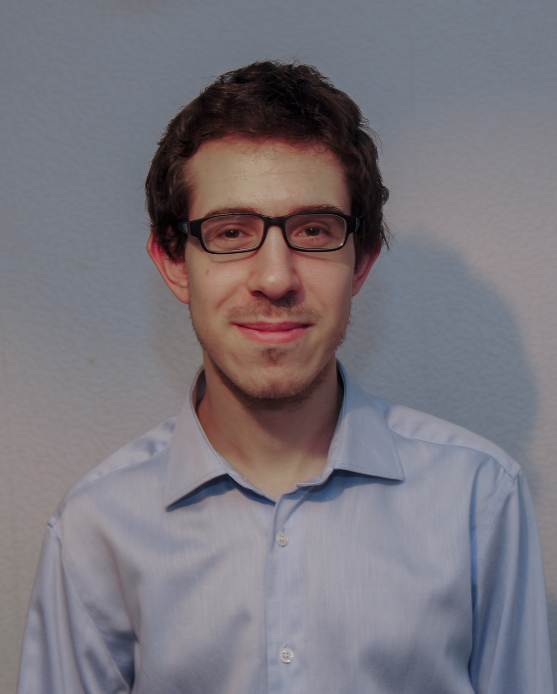

::: {.profile-grid}

::: {.profile-photo}
{.profile-image fig-alt="Vladimir Stadnichuk"}
:::

::: {.profile-text}

# Vladimir Stadnichuk

I am currently a research assistant in the Algorithmic Algebra and Discrete Mathematics group at the University of Kassel, where I work on the research project HALMA (“Hochschulübergreifend adaptive Lernwege Mathematik”). My work focuses on analyzing and improving curricula for mathematics courses in engineering programs. Before joining the University of Kassel, I completed my PhD at the Chair of Operations Management at RWTH Aachen University.

My research focuses on bilevel optimization, with particular emphasis on developing novel solution methods for challenging real-world applications in mobility and infrastructure planning.

:::

:::

::: {.columns}

::: {.column width="50%"}

## Research interests

- Bilevel optimization
- Bilevel network design
- Mixed-integer programming
- Decomposition methods
- Transportation and mobility systems

:::

::: {.column width="50%"}

## Education

🎓 **PhD in Mathematical Optimization, RWTH Aachen University**  
Chair of Operations Management, 2021–2026

🎓 **M.Sc. Mathematics, RWTH Aachen University**  
Minor in Computer Science, 2018–2020  
*with distinction*

🎓 **B.Sc. Mathematics, RWTH Aachen University**  
Minor in Computer Science, 2015–2018

:::

:::

## News

**24 November 2026 — BOS Webinar Series**  
I will give a talk in the [Bilevel Optimization Society (BOS) Webinar Series](https://bileveloptimization.org/bos_webinar/schedule.html).

**1–4 September 2026 — OR 2026**  
I will present at the [International Conference on Operations Research (OR 2026)](https://or2026.de/) in Passau, Germany.

**15 August 2026 — PhD Defense**  
I defended my PhD at RWTH Aachen University.

**1 January 2026 — New position at the University of Kassel**  
I started my new position as a research assistant in the Algorithmic Algebra and Discrete Mathematics group at the University of Kassel.

**4–6 August 2025 — FRICO 2025**  
The [28th Workshop on Future Research in Combinatorial Optimization (FRICO 2025)](https://frico.rwth-aachen.de/) is taking place at RWTH Aachen University. I am part of the organizing team of this year's workshop.

